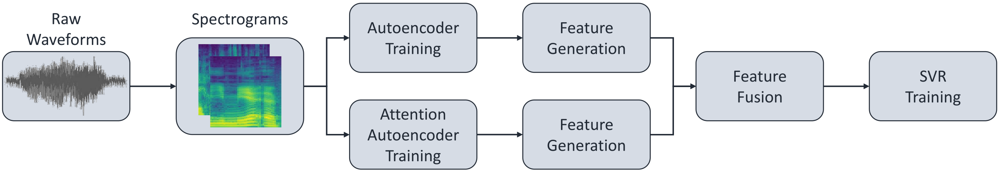
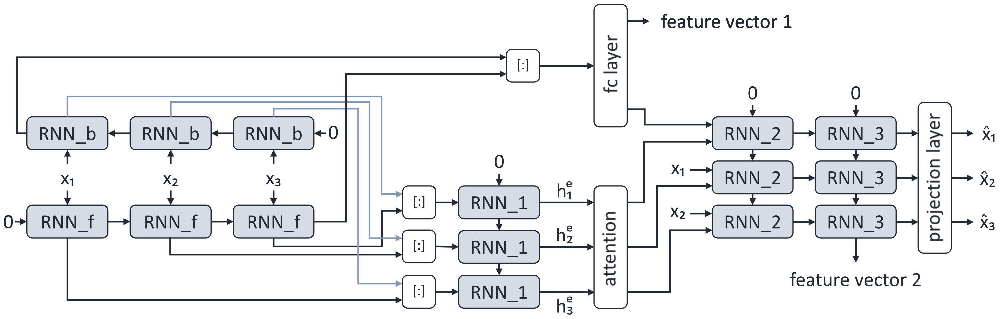

# Sequence to Sequence Autoencoders with Attention for Continuous Sleepiness

This repository contains the code for running experiments with Attention-Enhanced Sequence to Sequence Autoencoders on the Continuous Sleepiness dataset.

**(c) 2020 Shahin Amiriparian, Maurice Gerczuk, Pawel Winokurow, Sandra Ottl, Björn Schuller: Universität Augsburg**
Published under GPLv3, see the LICENSE.md file for details.

Please direct any questions or requests to Shahin Amiriparian (shahin.amiriparian at tum.de) or Maurice Gercuk (maurice.gerczuk at informatik.uni-augsburg.de).

# Citing
If you use *auttention* or any code from *auttention* in your research work, you are kindly asked to acknowledge the use of *auttention* in your publications. You can find our paper [here](https://arxiv.org/pdf/2005.08722).
> S. Amiriparian, P. Winokurov, V. Karas, S. Ottl, M. Gerczuk, B. Schuller. "A Novel Fusion of Attention and Sequence to Sequence Autoencoders to Predict Sleepiness From Speech", arxiv.org, May 2020. 5 pages.


## Requirements

You need Python 3.5 or later to run this program. 

## Installation

Use the package manager [pip](https://pip.pypa.io/en/stable/) to install python dependencies.

### Python Dependencies

- tensorflow
- scipy
- numpy
- matplotlib
- librosa
- Pillow
- opencv-python

### Installing in a virtualenv

 To create this virtual environment, first you need to install virtualenv.
```
pip install virtualenv
```
Then create a folder and activate a virtual environment.
```
virtualenv attentionEncoder source attentionEncoder/venv/bin/activate
```
Install the dependencies.
```
pip install -r requirements.txt
```
To deactivate virtual environment.
```
deactivate
```

## Running the experiments

The experimental structure consists of a pipeline with spectrogram creation, autoencoder training, feature extraction, fusion and evaluation via SVR. All steps are described below.

### Extracting spectrograms
To extract spectrograms and create dataset, you need to specify subcommand `extract_spectrograms`, the number of melbands `-n_mels`, length of the FFT window `-n_fft`, source directory with .wav data `-sd`, output directory `-od` and path to file with labels `-lab`.
```
python cli.py extract_spectrograms -nfft 1024 -nmel 240 -sd ComParE2019_ContinuousSleepiness/wav -od spectrograms -lab labels/labels.csv
```
### Dataset creation
To create a dataset, you need to specify subcommand `create_dataset` and source directory with spectrograms `-sd`.
```
python cli.py create_dataset -sd spectrograms
```
### Model Training
To train a model, you need to specify subcommand `train`, type of network `-nt`, checkpoint directory `-ckpt_dir`, number of epochs `-ne`, batch size `-bs`, learning_rate `-lr` and number of hidden units `-nu`. To train a model with the architecture in the figure below, use:
```
python cli.py train -nt attention_bi_bi_hidden -ne 10 -nu 256 -bs 64 -lr 0.001 -ckpt_dir ./training_checkpoints/attention
```



For a model without attention:
```
python cli.py train -nt seq2seq_bi_bi_fc -ne 10 -nu 256 -bs 64 -lr 0.001 -ckpt_dir ./training_checkpoints/seq2seq
```
### Extracting features
To extract features, you need to specify subcommand extract_features, the network type `-nt` the ouput file location `-od`, output filename `-fn` and  checkpoint directory `-ckpt_dir`.
```
python cli.py extract_features -nt seq2seq_bi_bi_fc -od features/seq2seq/ -fn seq2seq_bi_bi_fc -ckpt_dir training_checkpoints/seq2seq

python cli.py extract_features -nt attention_bi_bi_hidden -od features/attention/ -fn attention_bi_bi_hidden -ckpt_dir training_checkpoints/attention

```
### Fusion of Features
To fuse two feature sets, you need to specify the subcommand fusion, path to seq2seq feature set `-seq`, path to attention feature set `-att` and path to ouput file `-op`.
```
python cli.py fusion_features -seq features/seq2seq/seq2seq_features.train.csv -att features/attention/attention_features.train.csv -op features/fusion/fusion.train.csv

python cli.py fusion_features -seq features/seq2seq/seq2seq_features.devel.csv -att features/attention/attention_features.devel.csv -op features/fusion/fusion.devel.csv

python cli.py fusion_features -seq features/seq2seq/seq2seq_features.test.csv -att features/attention/attention_features.test.csv -op features/fusion/fusion.test.csv
```


### Predictions
To get predictions of test dataset, you need to specify subcommand `baseline`, path to train feature set `-train`, path to devel feature set `-devel`, path to test feature set `-test`, dimension of feature vector -`num_feat`, path to labels `-lab` and path to ouput file with predictions `pred`.
```
python cli.py baseline -train features/fusion/fusion.train.csv -devel features/fusion/fusion.devel.csv -test features/fusion/fusion.test.csv -lab labels/labels.csv -pred predictions/fusion_pred.csv -num_feat 512 
```
### Spearman correlation coefficient
To calculate a Spearman correlation coefficient between predictions and test dataset, you need to specify subcommand `test_result`, path to predictions `-pred` and path to test labels `-lab`. 
```
python cli.py test_result -pred predictions/fusion_pred.csv -lab labels/labels.csv
```
### Tensorboard
Training statistics are logged to tensorboard, you can view them with:
```
tensorboard --logdir path_to_project/tensorboard_logs
```


#### Related projects
[auDeep](https://www.github.com/auDeep/auDeep): Unsupervised audio representation learning via recurrent sequence-to-sequence autoencoder.

[DeepSpectrum](https://www.github.com/DeepSpectrum/DeepSpectrum): Audio feature extraction with large scale image recognition CNNs.


